<p align="center">
  
</p>

# shoulder-daemon

Context advisor for coding agents.
Injects relevant information when needed. Records facts and keeps them up to date as they change.

## How it works

A local Go daemon watches your session, maintains a bucket of facts and injects information
into the agent's session when that context is relevant.
Your agent doesn't need to do anything - so it can't forget to store a fact or consult a knowledgebase.
Storage and reasoning are both modular, and local-only is supported.

- **The working agent never manages memory.** It doesn't need to know how the memory is structured,
  doesn't check whether a fact is already stored, and can't skip the docs or ingest all
  of them at session start. Only relevant context is injected and only when needed.
- **Facts remain up-to-date.** When facts change, they supersede each-other.
  The agent doesn't need to manage this - it just receives up to date information.
- **Retrieval and updates are smart.** A small, low-latency model determines when facts need to be updated,
  injected into the session or created from scratch. Local inference is fully supported.

Something you mention once in passing comes back in a later session, without the agent
having to ask for it.

<p align="center">
  
</p>

## Install

Install the daemon, then the adapter for whichever editor you use. The adapters
start the daemon when the editor launches, and it stops when the last session
ends. Sessions will happily share a single daemon.

```bash
go install gitlab.com/quittymr/shoulder-daemon/relay/cmd/shoulderd@latest
```

`go install` puts the binary in `$(go env GOPATH)/bin`. The adapters look for
`shoulderd` on your `PATH`, so add that directory to it if it is not there
already.

**OpenCode** - copy into `~/.config/opencode/plugins/`, or into
`.opencode/plugins/` for a single project. OpenCode loads both.

```bash
mkdir -p ~/.config/opencode/plugins
curl -o ~/.config/opencode/plugins/shoulder-daemon.js https://gitlab.com/quittymr/shoulder-daemon/-/raw/main/adapters/opencode/shoulder-daemon.js
```

**Claude Code** - add the marketplace and install the plugin.

```
/plugin marketplace add https://gitlab.com/quittymr/shoulder-daemon
/plugin install shoulder-daemon
```

OpenCode is clearly the better informed harness here, as Claude Code removed thinking tokens. We deal with the pork we receive.

Select a model:

```bash
export SHOULDER_LLM=gemini          # and GEMINI_API_KEY
export SHOULDER_MEMORY_URL=http://127.0.0.1:8100    # optional; without it nothing is stored
```

### Choosing a model

`SHOULDER_LLM` names a connector, and takes a comma-separated list to fall back
through. `SHOULDER_LLM_MODEL` and `SHOULDER_LLM_BASE_URL` override the default
model and endpoint.

| Connector | Endpoint | Default model | Key |
|---|---|---|---|
| `gemini` | Google AI | `gemini-flash-lite-latest` | `GEMINI_API_KEY` |
| `openrouter` | OpenRouter | `google/gemini-2.5-flash-lite` | `OPENROUTER_API_KEY` |
| `glm` | z.ai | `glm-4.7-flash` | `GLM_API_KEY` |
| `glm-coding` | z.ai coding plan | `glm-5.3-flash` | `GLM_API_KEY` |
| `opencode-go` | OpenCode Go | `glm-5.3-flash` | `OPENCODE_API_KEY` |
| `openai` | OpenAI | `gpt-5.2-mini` | `OPENAI_API_KEY` |
| `local` | Ollama on `127.0.0.1:11434` | `qwen2.5-coder:7b` | none |

Pick for speed. The decision pass runs while your turn is open, and advice that
arrives after the assistant has chosen what to do is worth nothing, so a
flash-tier model beats a better one that thinks for twenty seconds; deciding
whether a turn contradicts a stored fact is classification, not authorship. On
one machine `gemini-3.5-flash-lite` answered in 0.9s and one coding-plan
endpoint took 29s, so time your own choice - the `shoulder_hook_latency_seconds`
metric with `event="advisor"` reports what the pass is costing you.

Those variables have to reach the daemon, which is not always the shell you
typed them in. If you run it as a container, a service, or from an editor
adapter, see [docs/INSTALL.md](docs/INSTALL.md) for where to put them.

Use `shoulderd doctor` to verify the validity of your installation and setup.

Running from a checkout, a container or a service manager is covered in
[docs/INSTALL.md](docs/INSTALL.md), along with every setting.

### Updating

```bash
git pull
make update
```

Then restart your editor and run `shoulderd doctor`.

## Use it

```bash
$ shoulderd message "this is my git repository"
main branch is master

$ shoulderd fact add --global "I prefer terse answers with no preamble"
$ shoulderd fact add --local --category=structure "integration tests need a live Postgres"
$ shoulderd fact list --local
$ shoulderd digest                      # narrative summary; --local or --global to narrow
```

`message` records what it learns by default. `--update` forces it, `--no-update`
answers without writing. Writes demand `--local` or `--global`; reads default to
this project, except `digest`, which covers both. `shoulderd help` spells out
each one.

## Alternatives

| | What triggers it | Where it stores | How it differs |
|---|---|---|---|
| **shoulder-daemon** | a small model reads each turn | any backend behind a five-method interface | keeps the store tidy as well as writing to it, and routes each note to the hook where it can still change something |
| [Natural Memory Triggers](https://github.com/doobidoo/mcp-memory-service) | regex and keyword matches on your prompt | SQLite-vec, Cloudflare or Milvus | no model in the loop, so it is faster and cheaper but only fires on wording it was told to watch for |
| [PowerContext](https://github.com/oceanbase/powercontext) | every prompt | SQLite, or OceanBase for teams | built for teams sharing one store, with a database to match |
| [claude-code-semantic-memory](https://github.com/razor-ai/claude-code-semantic-memory) | embedding similarity on your prompt | SQLite with local Ollama embeddings | retrieval only, entirely local, and nothing leaves the machine |
| [Letta Claude Subconscious](https://github.com/letta-ai/claude-subconscious) | a background agent reads each finished turn | Letta, self-hosted or theirs | the closest design here; it brings Letta's agent framework with it rather than a single binary |
| [ContextStream](https://github.com/contextstream/mcp-server) | tools the agent chooses to call, plus hooks | their hosted service | the agent decides when to remember, which is a tool it can also decide to skip |

## Docs

- [How it works](docs/ARCHITECTURE.md) - the hot path, the injection budget, why a hook can't block
- [Install and configure](docs/INSTALL.md)
- [Advisor protocol](docs/ADVISOR.md) - bring your own decision model

## Status

Working and tested against Claude Code 2.1.251 and OpenCode 1.18.25. More model
and memory connectors are coming. Contributing notes and the house rules are in
[docs/INSTALL.md](docs/INSTALL.md); issues and merge requests at
<https://gitlab.com/quittymr/shoulder-daemon>.

## Licence

MIT. See [LICENSE](LICENSE).
